# Sistem Pengelolaan Data Narapidana        

## 📌 Identitas
- **Nama** : Rivalio Chendra
- **NIM**  : 2509116039
- **Praktikum** : Pemrograman Berorientasi Objek
- **Kelas** : A

---
 
## 📖 Deskripsi Program
 
Sistem Pengelolaan Data Narapidana merupakan program yang digunakan untuk mengelola data narapidana dalam sebuah lembaga pemasyarakatan. Program ini memungkinkan admin untuk menyimpan, menampilkan, mengubah, dan menghapus data narapidana melalui menu yang tersedia.

### Data yang Dikelola

| Data | Keterangan |
|---|---|
| ID Narapidana | Identitas unik setiap narapidana |
| Nama | Nama narapidana |
| Kasus | Kasus atau tindak pidana yang dilakukan |
| Masa Tahanan | Lama masa tahanan dalam bulan |
| Nomor Sel | Nomor sel tempat narapidana ditempatkan |
| Blok Sel | Blok tempat sel narapidana berada |

Program memiliki beberapa kategori narapidana. Setiap kategori memiliki informasi tambahan yang berbeda sesuai dengan jenis kasusnya.

### Kategori Narapidana

| Kategori | Informasi Tambahan | Punya Pemeriksaan Rutin? |
|---|---|---|
| Narkotika | Jenis rehabilitasi | ✅ Ya |
| Terorisme | Tingkat risiko | ✅ Ya |
| Korupsi | Uang pengganti | ❌ Tidak |
| Pembunuhan | Kategori pembunuhan | ✅ Ya |
| Pencurian | Nilai kerugian | ❌ Tidak |

> Kolom "Pemeriksaan Rutin" ini dijelaskan lebih lanjut di bagian **Penerapan Interface**.

### Fitur Program

| Menu | Fungsi |
|---|---|
| Tampilkan Narapidana | Menampilkan seluruh data narapidana yang tersimpan |
| Tambah Narapidana | Menambahkan data narapidana baru sesuai kategori |
| Update Nomor Sel | Mengubah nomor sel berdasarkan ID narapidana |
| Hapus Narapidana | Menghapus data narapidana berdasarkan ID |
| Tampilkan Berdasarkan Kategori | Menampilkan narapidana yang termasuk dalam satu kategori kejahatan tertentu saja |
| Keluar | Mengakhiri program |

---  


## 🗂️ Struktur Project MVC
Program menggunakan struktur MVC (Model-View-Controller) untuk memisahkan bagian data, tampilan, dan pengelolaan proses program. Berikut adalah struktur package program:    

```
Lapas [main]
└── Source Packages
    │
    ├── com.mycompany.lapas
    │   └── Main.java
    │
    ├── controller
    │   └── AdminLapas.java
    │
    ├── model
    │   ├── Narapidana.java
    │   ├── NarapidanaKorupsi.java
    │   ├── NarapidanaNarkotika.java
    │   ├── NarapidanaPembunuhan.java
    │   ├── NarapidanaPencurian.java
    │   ├── NarapidanaTerorisme.java
    │   └── PemeriksaanRutin.java      ← interface
    │
    └── view
        └── NarapidanaView.java
```


| Lapisan | Isi | File |
|---|---|---|
| **Model** | Atribut, constructor, getter/setter, method `getInfo()` yang mengembalikan `String` (tidak mencetak apa pun) | `Narapidana.java`, 5 subclass-nya, dan `PemeriksaanRutin.java` |
| **View** | Seluruh `System.out.println`/`print`, `Scanner`, dan validasi input | `NarapidanaView.java` |
| **Controller** | `ArrayList`, logika CRUD, memanggil Model dan View | `AdminLapas.java` |
| **Main** | Titik awal program, membuat objek, mengisi dummy data, menjalankan menu | `Main.java` |

```java
// Model hanya mengembalikan String, TIDAK mencetak apa pun
public String getInfo() {
    return "ID Narapidana : " + idNapi + "...";
}
```
```java
// View satu-satunya tempat yang mencetak ke layar
public void tampilkanInfoNarapidana(Narapidana n) {
    System.out.println(n.getInfo());
}
```

Dengan pemisahan ini, jika tampilan program ingin diubah, cukup ubah `NarapidanaView.java` tanpa perlu menyentuh logika CRUD di `AdminLapas.java`, maupun struktur data di `Narapidana.java`.

---

## 🔄 Alur Program   

1. Program dimulai dari `main()` di class `Main`. Objek `Scanner`, `NarapidanaView`, dan `AdminLapas` dibuat, lalu 5 data awal (satu untuk tiap kategori kejahatan) dimasukkan ke `ArrayList` melalui method `tambahDataAwal()`.
2. Program masuk ke perulangan `while` yang terus menampilkan menu dan menerima pilihan pengguna, sampai pengguna memilih menu Keluar.
3. Setiap pilihan menu (1–6) diarahkan lewat percabangan `switch` ke method yang sesuai di `AdminLapas`:
   - **Tampilkan**: menampilkan seluruh data dengan perulangan `for`. Untuk narapidana dari kategori yang memiliki pemeriksaan rutin (Narkotika, Terorisme, Pembunuhan), baris jenis pemeriksaannya otomatis ikut tercetak.
   - **Tambah**: menanyakan kategori kejahatan (submenu 1–5) terlebih dahulu, lalu membuat objek dari subclass yang sesuai.
   - **Update**: mencari data berdasarkan ID, lalu mengubah nomor selnya.
   - **Hapus**: mencari data berdasarkan ID, lalu menghapusnya dari `ArrayList`.
   - **Tampilkan Berdasarkan Kategori**: pengguna mengetik nama kategori (misalnya "Narkotika"), lalu program menampilkan hanya narapidana yang kategorinya cocok. Jika tidak ada satu pun yang cocok, program menampilkan pesan bahwa kategori tersebut tidak ditemukan.
4. Untuk fitur Update dan Hapus, pencarian data menggunakan `boolean ditemukan`. Jika ID tidak ditemukan, pesan error ditampilkan tanpa menghentikan program. Logika pencarian yang sama juga dipakai di fitur Tampilkan Berdasarkan Kategori, hanya saja yang dicocokkan adalah kategori, bukan ID.
5. Seluruh input divalidasi terlebih dahulu di `NarapidanaView` sebelum diproses (lihat tabel validasi di bawah). Validasi juga diterapkan sekali lagi di dalam Model sebagai lapisan keamanan tambahan (dijelaskan di bagian Encapsulation).
6. Program terus berulang sampai pengguna memilih menu Keluar, yang mengubah `berjalan` menjadi `false` dan menghentikan perulangan `while`.

### Validasi Input

| No | Validasi | Pesan yang Ditampilkan |
|----|----------|------------------------|
| 1 | ID/Nama/Kasus tidak boleh kosong | "... tidak boleh kosong, coba lagi." |
| 2 | ID tidak boleh sama dengan data yang sudah ada | "ID sudah digunakan, data batal ditambahkan." |
| 3 | Kategori kejahatan harus 1–5 | "Kategori tidak valid, data batal ditambahkan." |
| 4 | Input angka tidak boleh berupa huruf/teks | "Input harus berupa angka, coba lagi." |
| 5 | Angka (masa tahanan, uang pengganti, dll) harus lebih besar dari 0 | "Angka harus lebih besar dari 0, coba lagi." |

Validasi angka menggunakan `scanner.hasNextInt()`/`hasNextLong()` di dalam perulangan `while`, sehingga program tidak berhenti (crash) meskipun pengguna salah memasukkan tipe data.

---

## 🔐 Penerapan Encapsulation dan Inheritance
### Encapsulation

Seluruh atribut pada class `Narapidana` dideklarasikan dengan modifier **`private`**, sehingga tidak dapat diakses langsung dari class lain. Akses hanya bisa dilakukan melalui method `public` berupa getter dan setter.

```java
public abstract class Narapidana {
    private final String idNapi;
    private final String nama;
    private final String kasus;
    private final int masaTahanan;

    private String nomorSel;
    private String blokSel;

    public String getIdNapi() {
        return idNapi;
    }

    public void setNomorSel(String nomorSel) {
        if (nomorSel == null || nomorSel.isEmpty()) {
            System.out.println(">> Nomor sel tidak boleh kosong.");
            return;
        }
        this.nomorSel = nomorSel;
    }
    // getter dan setter lainnya...
}
```

Dengan cara ini, `AdminLapas` (Controller) tidak pernah menulis `n.idNapi = "..."` secara langsung, melainkan selalu melalui `n.getIdNapi()` atau `n.setNomorSel(...)`, sehingga data tidak dapat diubah secara sembarangan dari luar class-nya.

**Terdapat dua  jenis Encapsulation yang diterapkan yaitu:**

1. **Keyword `final`** digunakan pada atribut `idNapi`, `nama`, `kasus`, dan `masaTahanan`. Keempat atribut ini memang tidak memiliki setter, artinya nilainya tidak boleh berubah setelah narapidana didaftarkan. Dengan `final`, Java akan menolak meng-compile program jika suatu saat ada yang mencoba menambahkan setter untuk atribut ini. Atribut `nomorSel` dan `blokSel` sengaja tidak dibuat `final`, karena memang harus bisa diubah lewat fitur Update Nomor Sel.
2. **Validasi di dalam setter.** Validasi input (tidak boleh kosong, harus angka positif, dll) diterapkan di dua tempat: di `NarapidanaView` saat membaca input dari keyboard, dan di dalam setter masing-masing (`setNomorSel`, `setUangPengganti`, dan seterusnya) sebelum nilainya benar-benar diubah. Jadi meskipun ada bagian program lain yang memanggil setter secara langsung tanpa melalui `NarapidanaView`, data yang tidak valid tetap akan ditolak oleh objeknya sendiri.

### Inheritance

Program menerapkan inheritance dengan **1 superclass** (`Narapidana`) dan **5 subclass**, satu untuk setiap kategori kejahatan:

```text
                         ┌───────────────────────────┐
                         │ Narapidana (Superclass)   │
                         ├───────────────────────────┤
                         │ - idNapi                  │
                         │ - nama                    │
                         │ - kasus                   │
                         │ - masaTahanan             │
                         │ - nomorSel                │
                         │ - blokSel                 │
                         └───────────────────────────┘
                                       │
                                     extends
                                       │
        ┌──────────────────────────────┼───────────────────────────────────┐
        │                │             │                  │                │
        │                │             │                  │                │
┌───────┴───────┐ ┌──────┴───────┐ ┌───┴────────┐ ┌───────┴───────┐ ┌──────┴───────┐
│ Narkotika     │ │ Terorisme    │ │ Korupsi    │ │ Pembunuhan    │ │ Pencurian    │
│ (Subclass)    │ │ (Subclass)   │ │ (Subclass) │ │ (Subclass)    │ │ (Subclass)   │
├───────────────┤ ├──────────────┤ ├────────────┤ ├───────────────┤ ├──────────────┤
│ +jenis        │ │ +tingkat     │ │ +uang      │ │ +kategori     │ │ +nilai       │
│  Rehabilitasi │ │  Risiko      │ │  Pengganti │ │  Pembunuhan   │ │  Kerugian    │
└───────────────┘ └──────────────┘ └────────────┘ └───────────────┘ └──────────────┘
```

**Contoh subclass, `NarapidanaKorupsi`:**
```java
public class NarapidanaKorupsi extends Narapidana {
    private long uangPengganti;

    public NarapidanaKorupsi(String idNapi, String nama, String kasus, int masaTahanan,
                              String nomorSel, String blokSel, long uangPengganti) {
        super(idNapi, nama, kasus, masaTahanan, nomorSel, blokSel); // memanggil constructor superclass
        this.uangPengganti = uangPengganti;
    }

    @Override
    protected String getDetailKhusus() {
        return "Uang Pengganti: Rp" + uangPengganti;
    }

    @Override
    public String getKategori() {
        return "KORUPSI";
    }
}
```

Setiap subclass mewarisi seluruh atribut umum dari `Narapidana`, lalu menambahkan satu atribut khusus yang hanya relevan untuk kategori kejahatannya. Ini menghindari pemaksaan atribut yang tidak relevan ke seluruh narapidana, misalnya, "Uang Pengganti" hanya bermakna untuk kasus Korupsi, bukan Pencurian.

> Subclass tidak meng-override `getInfo()` secara langsung, melainkan mengisi `getDetailKhusus()` dan `getKategori()`. Alasannya dijelaskan di bagian **Penerapan Abstraction** di bawah ini.

---

## 🧱 Penerapan Abstraction

`Narapidana` dideklarasikan sebagai **`abstract class`**, dan memiliki **dua `abstract method`**:

```java
public abstract class Narapidana {
    // ...atribut dan constructor...

    // Method ini SUDAH punya isi, dan SAMA untuk semua subclass.
    // Bagian terakhirnya memanggil dua method abstract di bawah.
    public String getInfo() {
        return "ID Narapidana : " + idNapi + "\n"
                + "Nama          : " + nama + "\n"
                + "Kasus         : " + kasus + "\n"
                + "Masa Tahanan  : " + masaTahanan + " bulan\n"
                + "Sel           : " + nomorSel + " (" + blokSel + ")\n"
                + getDetailKhusus() + "\n"
                + "Kategori      : " + getKategori();
    }

    // ABSTRACT METHOD: tidak punya isi sama sekali di class ini.
    // Setiap subclass WAJIB menuliskan isinya sendiri.
    protected abstract String getDetailKhusus();
    public abstract String getKategori();
}
```

**Kenapa dibuat `abstract`, bukan class biasa?**

Karena secara logika, tidak masuk akal ada objek "Narapidana" polos tanpa kategori kejahatan yang jelas. Setiap narapidana di dunia nyata pasti termasuk salah satu dari lima kategori yang ada. Dengan menjadikan `Narapidana` abstract:

- Program tidak akan bisa membuat objek `new Narapidana(...)` secara langsung, Java akan menolaknya saat di-compile.
- Objek hanya bisa dibuat lewat salah satu dari lima subclass-nya (`new NarapidanaKorupsi(...)`, dan seterusnya), yang masing-masing wajib mengisi `getDetailKhusus()` dan `getKategori()` miliknya sendiri.

Sebagai perbandingan, method `getInfo()` bukan abstract, isinya sudah ditulis lengkap di `Narapidana` dan sama untuk semua subclass, karena bagian format dasarnya (ID, Nama, Kasus, Masa Tahanan, Sel) memang selalu sama. Yang berbeda hanyalah dua baris terakhir, dan itu diserahkan ke `getDetailKhusus()` serta `getKategori()`.

---

## 🧩 Penerapan Polymorphism

### 1. Method Overriding

Kedua `abstract method` pada `Narapidana`, yaitu `getDetailKhusus()` dan `getKategori()`, di-override oleh setiap subclass untuk mengisi informasi sesuai kategorinya masing-masing:

```java
// Subclass NarapidanaKorupsi
@Override
protected String getDetailKhusus() {
    return "Uang Pengganti: Rp" + uangPengganti;
}

@Override
public String getKategori() {
    return "KORUPSI";
}
```

Manfaatnya terlihat pada `AdminLapas`, yang menyimpan seluruh data dalam satu `ArrayList<Narapidana>` walaupun isinya campuran objek dari 5 subclass berbeda:

```java
private ArrayList<Narapidana> daftarNarapidana;

public void tampilkanNarapidana() {
    for (Narapidana n : daftarNarapidana) {
        view.tampilkanInfoNarapidana(n); // memanggil n.getInfo(), yang di dalamnya memanggil getDetailKhusus() dan getKategori()
        ...
    }
}
```

Java secara otomatis memanggil `getDetailKhusus()` dan `getKategori()` sesuai jenis objek aslinya. Jika objeknya `NarapidanaKorupsi`, yang terpanggil adalah versi milik `NarapidanaKorupsi`, bukan class lain. Controller tidak perlu memeriksa satu per satu jenis objeknya, cukup memanggil `getInfo()` dan Java yang menentukan versi mana yang dijalankan di baliknya.

### 2. Method Overloading

Selain overriding, program ini juga menerapkan overloading, dua method dengan nama yang sama, tetapi parameter yang berbeda, di dalam class `AdminLapas`:

```java
// Versi 1: tanpa parameter, menampilkan SEMUA narapidana
public void tampilkanNarapidana() {
    for (Narapidana n : daftarNarapidana) {
        view.tampilkanInfoNarapidana(n);
        ...
    }
}

// Versi 2: dengan parameter String, menampilkan narapidana dari SATU kategori saja
public void tampilkanNarapidana(String kategori) {
    for (Narapidana n : daftarNarapidana) {
        if (n.getKategori().equalsIgnoreCase(kategori)) {
            view.tampilkanInfoNarapidana(n);
            ...
        }
    }
}
```

Java membedakan kedua method ini berdasarkan jumlah dan tipe parameternya, bukan dari isi method-nya. Saat dipanggil `admin.tampilkanNarapidana()` tanpa argumen, Java menjalankan versi pertama. Saat dipanggil `admin.tampilkanNarapidana("Narkotika")` dengan satu argumen `String`, Java otomatis menjalankan versi kedua. Inilah yang mendasari fitur menu Tampilkan Berdasarkan Kategori.

---

## 🔌 Penerapan Interface

Program ini menerapkan satu `interface` bernama `PemeriksaanRutin`:

```java
package model;

public interface PemeriksaanRutin {
    String getJenisPemeriksaan();
}
```

Interface ini tidak di-`implements` oleh semua subclass, melainkan hanya oleh kategori yang di dunia nyata memang memiliki program pemeriksaan/pengawasan rutin secara berkala yaitu **Narkotika**, **Terorisme**, dan **Pembunuhan**. Kategori **Korupsi** dan **Pencurian** tidak memilikinya, karena tidak ada kewajiban pemeriksaan rutin semacam ini untuk kedua kasus tersebut.

```java
public class NarapidanaNarkotika extends Narapidana implements PemeriksaanRutin {
    ...
    @Override
    public String getJenisPemeriksaan() {
        return "Tes urine setiap 2 minggu";
    }
}
```

```java
public class NarapidanaTerorisme extends Narapidana implements PemeriksaanRutin {
    ...
    @Override
    public String getJenisPemeriksaan() {
        if (tingkatRisiko.equalsIgnoreCase("Tinggi")) {
            return "Pemeriksaan sel dan komunikasi setiap hari";
        }
        return "Pemeriksaan sel dan komunikasi setiap minggu";
    }
}
```

Di `AdminLapas`, program mengecek apakah sebuah objek narapidana "memiliki" interface ini menggunakan `instanceof`, sebelum menampilkan baris Pemeriksaan tambahan:

```java
for (Narapidana n : daftarNarapidana) {
    view.tampilkanInfoNarapidana(n);

    if (n instanceof PemeriksaanRutin p) {
        view.tampilkanPesan("Pemeriksaan   : " + p.getJenisPemeriksaan());
    }
    ...
}
```

Narapidana kategori Korupsi dan Pencurian akan melewati blok `if` ini begitu saja (karena bukan `instanceof PemeriksaanRutin`), sedangkan Narkotika, Terorisme, dan Pembunuhan akan menampilkan baris "Pemeriksaan" tambahan sesuai kategorinya. Interface ini memberikan cara yang rapi untuk menambahkan kemampuan khusus hanya pada subclass tertentu, tanpa harus memaksakan method itu ada di semua subclass lewat superclass.

---

## 🖼️ Dokumentasi Hasil Uji Coba Program   
## Tampilan Menu Utama     
**1. Menu Utama**
 
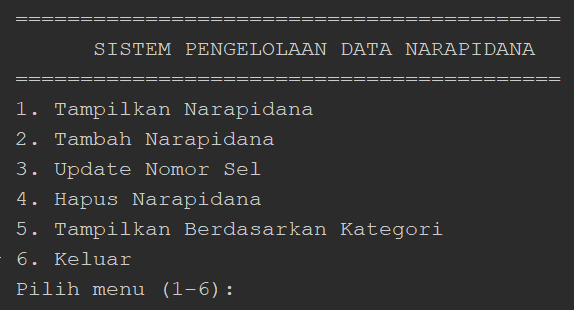
 
Tampilan awal saat program dijalankan, menampilkan 6 pilihan menu. Lima data awal (satu untuk tiap kategori kejahatan) sudah dimuat secara otomatis.
 <br> <br>

**2. Tampilkan Narapidana**
 
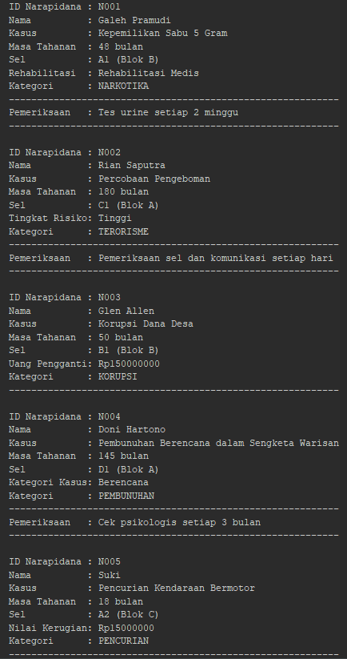
 
Hasil dari menu nomor 1 adalah seluruh data narapidana ditampilkan dalam format kartu, dengan atribut tambahan yang berbeda sesuai kategorinya masing-masing. Untuk narapidana kategori Narkotika, Terorisme, dan Pembunuhan, akan muncul baris tambahan "Pemeriksaan" yang didapat lewat interface `PemeriksaanRutin`.
  <br> <br>

**3. Tambah Narapidana**
 
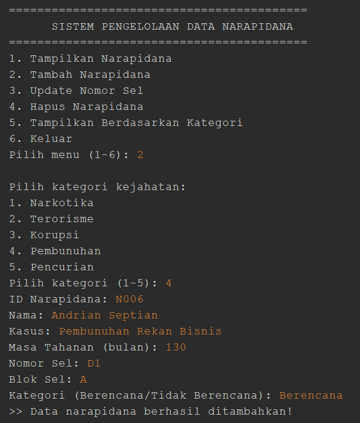
 
Setelah memilih menu Tambah, program menanyakan kategori kejahatan terlebih dahulu untuk menentukan subclass mana yang akan dibuat. Proses input data narapidana baru, ID, Nama, Kasus, Masa Tahanan, Nomor Sel, Blok Sel, dan satu atribut tambahan sesuai kategori yang dipilih.
  <br> <br>

**4. Update Nomor Sel**
 
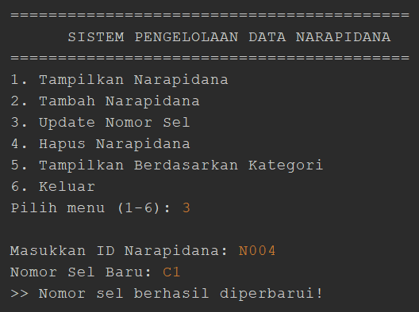
 
Proses pembaruan nomor sel, program mencari data berdasarkan ID yang dimasukkan, lalu memperbarui nomor selnya.
  <br> <br>

**5. Hapus Narapidana**
 
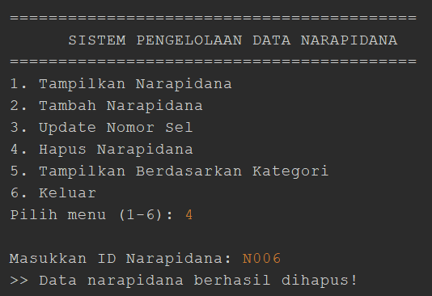
 
Proses penghapusan data berdasarkan ID yang dimasukkan.
  <br> <br>

**6. Tampilkan Berdasarkan Kategori**

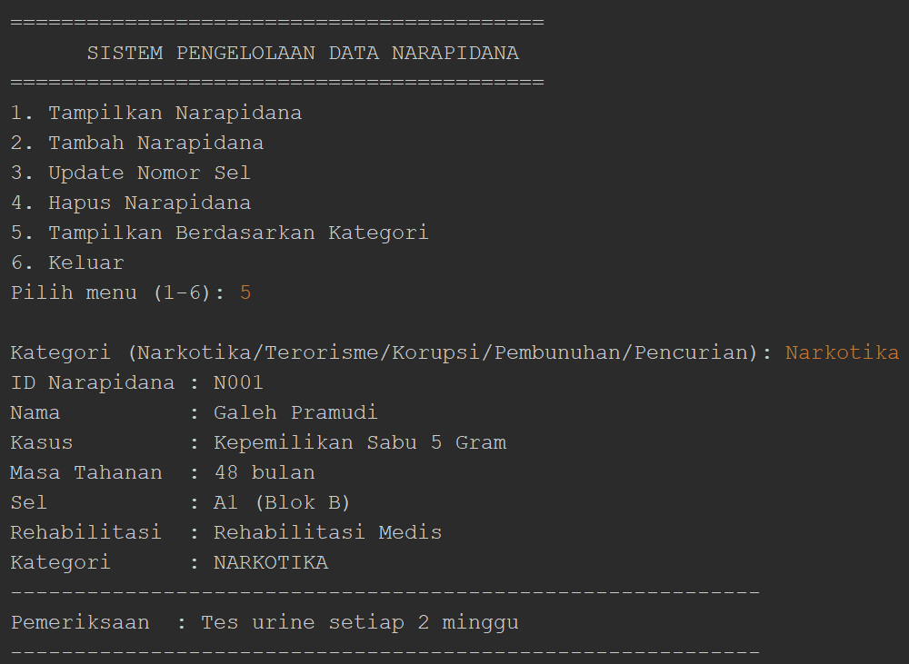

Pengguna mengetik nama kategori yang ingin dilihat (misalnya "Narkotika"), lalu program hanya menampilkan narapidana yang kategorinya cocok.
  <br> <br>

**7. Keluar**
 
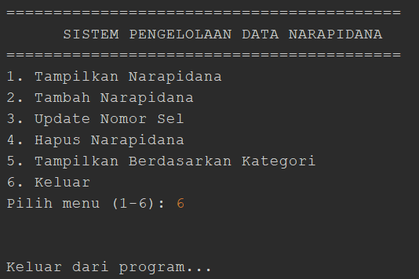
 
Pesan penutup yang muncul saat memilih menu Keluar.
  <br> <br>

**8. Validasi Input Kosong**
 
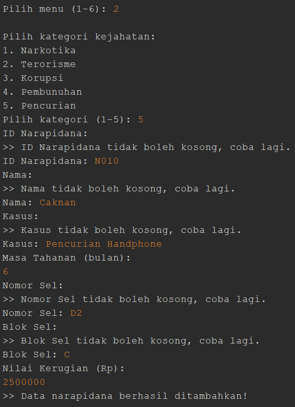
 
Pesan error saat kolom seperti ID/Nama/Kasus dibiarkan kosong.
  <br> <br>

**9. Validasi ID Duplikat**
 
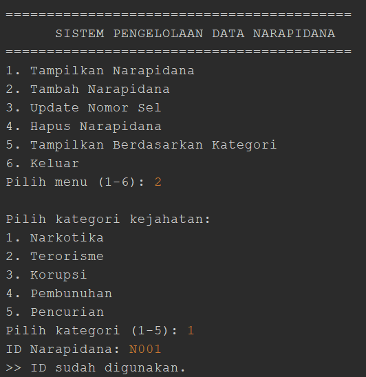
 
Pesan error saat ID yang dimasukkan sudah digunakan narapidana lain.
  <br> <br>

**10. Validasi Kategori Tidak Valid**
 
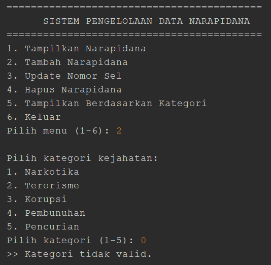
 
Pesan error saat kategori kejahatan dipilih di luar angka 1–5.
 <br> <br>

**11. Validasi Input Bukan Angka**
 
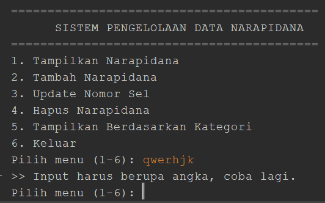
 
Pesan error saat kolom yang seharusnya diisi angka justru diisi huruf/teks.
  <br> <br>

**12. Validasi Angka Harus Positif**
 
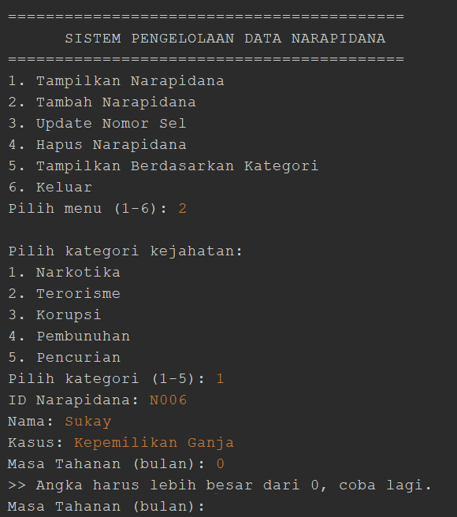
 
Pesan error saat angka yang dimasukkan bernilai 0 atau negatif.
